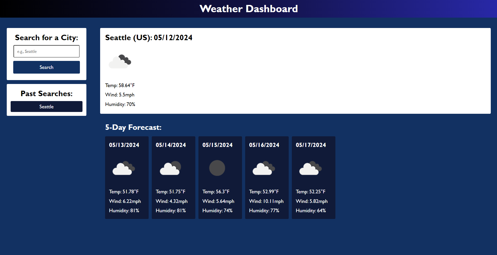

# weather-dashboard

## Description

This webpage is designed to aid a traveler with planning their trip by providing a weather outlook multiple cities. Throughout the development process, I gained a lot of experience working with different APIs and 'fetching' the necessary data. 

## Usage

To open the website portfolio, click this link here to go directly!

[Weather Dashboard](https://geovko.github.io/weather-dashboard/)

*OR* Copy this link to paste it into a browser.
  ```md
https://geovko.github.io/weather-dashboard/
  ```




Since an empty screen doesn't seem as inviting, the webpage is preset to load weather data from Seattle, WA (my hometown). 

On the left, is an area to input a city name. Once the 'Search' button is clicked the page will load the related weather information. Please note, this webpage utilizes the information provided by the OpenWeather API. As such, if the inputted city is not available in its system, it will find the data provided by the nearest available city in its system. Moreover, if that are differences in spellings, the webpage will approximate the inputted city name.

Right below is a list of past searches made by the user. The amount of past searches displayed is limited to 10, and will remove the oldest search item once the amount surpasses that number. The past search listings are also clickable and will provide the weather information of the chosen city when clicked. 

On the right, are two main sections. The upper section provides the weather measurements taken at the current moment. The lower section provides a forecast of the following 5 days.

## Credits

This project wouldn't have been completed without the aid of demonstrations and assignments provided by the UCI Bootcamp teaching staff. Moreover, this project wouldn't have been possible without the weather information provided by OpenWeather API. 

## License

MIT License

